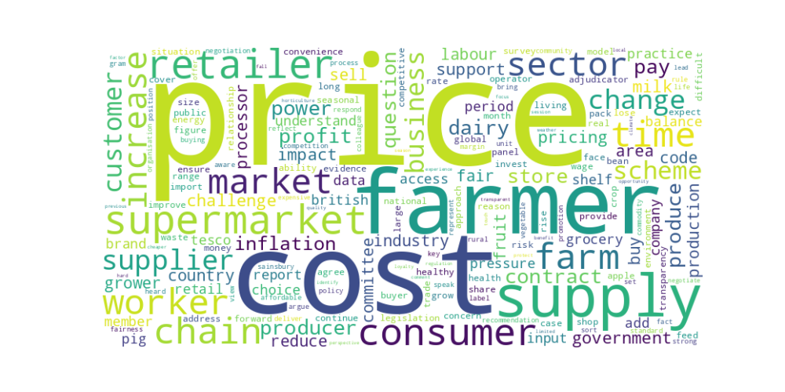
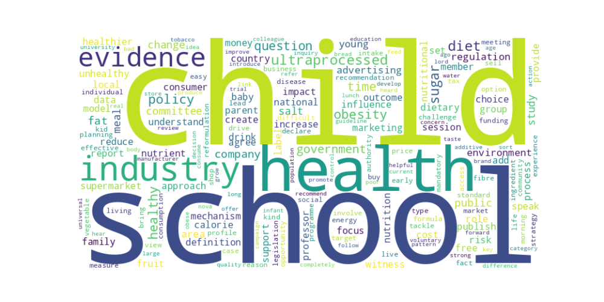

# Think Better World - Data-driven insights for transformational change

Welcome to our updated results presentation for the upcoming **Groundswell 2024**!

- [Join us on LinkedIn](https://www.linkedin.com/showcase/think-better-world/) for updates.
- Visit our [Think Better World Alliance Website](http://www.thinkbetterworld.com/) to get involved.

## Overview

This section now includes our newest analyses from June, alongside our continuing work from May 2024.

## Previous Analysis Results (May)

### Word Clouds

    

        <h3>Environment, Food, and Rural Affairs Committee - Fairness in the Food Supply Chain Inquiry</h3>
        
    

    

        <h3>Food, Diet, and Obesity Committee - Food, Diet, and Obesity Inquiry</h3>
        
    

### pyLDAvis Visualizations

#### Environment, Food, and Rural Affairs
<iframe src="assets/202405/EnvironmentFoodRuralAffairs_LDA_Visualization.html" style="width: 100%; height: 100vh; border: none;"></iframe>

#### Food, Diet, and Obesity
<iframe src="assets/202405/FoodDietandObesity_LDA_Visualization.html" style="width: 100%; height: 100vh; border: none;"></iframe>

### Bigram Networks
<iframe src="assets/202405/network/index.html" style="width: 100%; height: 80vh; border: none;"></iframe>

## New Analysis Results (June)

### Inquiries of the Environment, Food, and Rural Affairs Committee
<iframe src="assets/202406/Count_different_inquiries/distribution_different_inquiries_colourful.html" style="width: 100%; height: 100vh; border: none;"></iframe>

### Trends of activities change over years
<iframe src="assets/202406//Users/weiyao/Github/tbw-preliminary-results/assets/202406/Trend-number-of-activities-over-year/yearly activity count per inquiry bar chart.html" style="width: 100%; height: 100vh; border: none;"></iframe>

<iframe src="assets/202406//Users/weiyao/Github/tbw-preliminary-results/assets/202406/Trend-number-of-activities-over-year/treemap_chart_blue.html" style="width: 100%; height: 100vh; border: none;"></iframe>

## Important Food Topics
<iframe src="https://www.menti.com/al6ejbwvhnbe" style="width: 100%; height: 80vh; border: none;"></iframe>
